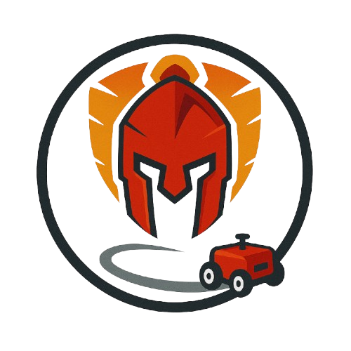

# Seguidor de Linha - Titans

  
<b></b>

## Sobre o projeto

Este repositório é dedicado à documentação de todos os artefatos criados pela frente do seguidor de linha da equipe de robótica da Titans.

O objetivo central do projeto é desenvolver um suuuuuuper seguidor de linhas miranha.

## 🗃️ Documentação

Link para a nossa documentação do projeto: [Clique Aqui](https://felipefreire-gf.github.io/seguidorDeLinha/)  

